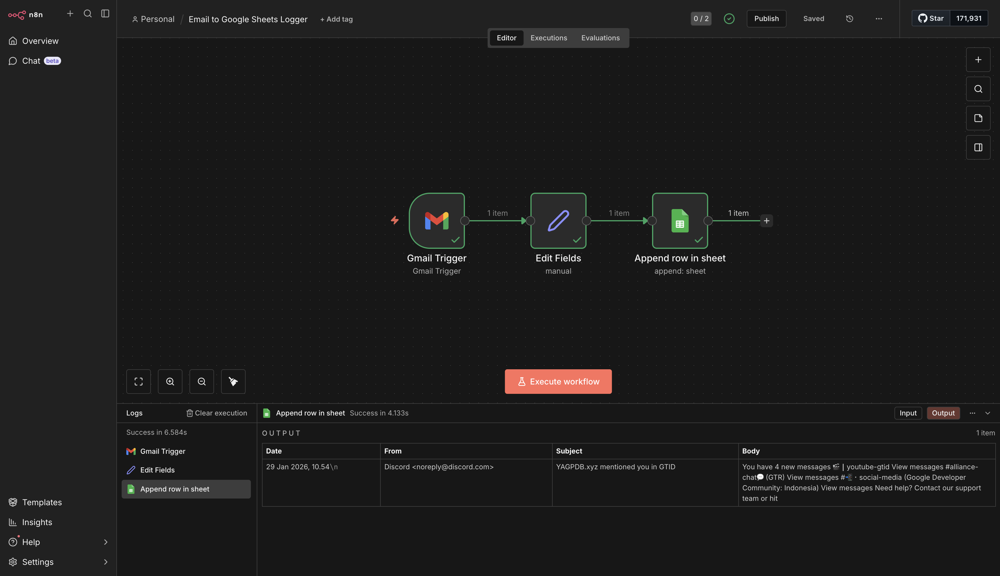

# 📧 Email to Google Sheets Logger

> Automatically log incoming emails into a Google Sheet using n8n workflow automation.


## 📌 Overview

This project automatically logs incoming emails into a Google Sheet using **n8n**. Whenever a new email is received in Gmail, the workflow extracts the date, sender, subject, and body, then appends them as a new row in Google Sheets.



### Tech Stack

| Technology | Purpose |
|------------|---------|
| n8n | Workflow automation platform |
| Gmail Trigger | Detect incoming emails |
| Google Sheets API | Store email data |
| OAuth 2.0 | Authentication with Google services |

## 🎯 Features

- ✅ Automatically store emails for tracking, analytics, or CRM purposes
- ✅ Create a searchable email database without manual copy-paste
- ✅ Real-time email logging as they arrive
- ✅ Extracts date, sender, subject, and body
- ✅ Exportable workflow JSON for reuse

## 🛠️ Workflow Architecture

```
Gmail Trigger → Set Node → Google Sheets (Append Row)
```

### Node Functions

| Node | Function |
|------|----------|
| Gmail Trigger | Detects new incoming emails |
| Set Node | Extracts and formats email data |
| Google Sheets | Appends email data as new row |

## 🚀 Setup Guide

### 1️⃣ Set Up Google Cloud Credentials

1. Go to [Google Cloud Console](https://console.cloud.google.com/)
2. Create a new project
3. Enable **Gmail API** and **Google Sheets API**
4. Create **OAuth 2.0 credentials**
5. Download the credentials JSON

### 2️⃣ Configure n8n Credentials

1. In n8n, go to **Credentials**
2. Add **Google OAuth2 API** credential
3. Paste your Client ID and Client Secret
4. Authorize with your Google account

### 3️⃣ Create Google Sheet

1. Create a new Google Sheet
2. Add headers in the first row:

| Date | From | Subject | Body |
|------|------|---------|------|

3. Copy the Sheet ID from the URL

### 4️⃣ Build the Workflow

**Gmail Trigger Node:**
- Set to trigger on new emails
- Configure polling interval

**Set Node** (format data):
```javascript
{
  "date": "{{$json['date']}}",
  "from": "{{$json['from']['value'][0]['address']}}",
  "subject": "{{$json['subject']}}",
  "body": "{{$json['snippet']}}"
}
```

**Google Sheets Node:**
- Select your spreadsheet
- Set operation to **Append Row**
- Map fields to columns

## 🧪 Testing

1. Send a test email to your Gmail account
2. Wait for the trigger or run manually
3. Check Google Sheet for the new row

## 📁 Project Structure

```
email-to-sheets-logger/
├── Email to Google Sheets Logger.json
├── README.md
└── Screenshot 2026-01-29 at 18.14.40.png
```

## 📦 Installation

1. Clone this repository
2. Import the workflow JSON into n8n
3. Configure your Google OAuth2 credentials
4. Update Google Sheet ID in the workflow
5. Activate the workflow

```bash
# Import workflow in n8n
# Go to: Workflows → Import from File → Select "Email to Google Sheets Logger.json"
```

## 💡 Use Cases

- 📊 Email tracking and analytics
- 📋 CRM email logging
- 📝 Sales lead capture
- 🔍 Searchable email archive
- 📈 Email volume monitoring

## 📌 Future Improvements

- [ ] Add email filtering by sender or subject
- [ ] Parse email attachments
- [ ] Add sentiment analysis on email content
- [ ] Create daily/weekly email summary reports
- [ ] Add Slack notification for important emails

## 🖼️ Screenshot


## 🎥 Demo

> 📹 [Watch Demo Video](#) *(Add Loom link here)*

## 👨‍💻 Author

**Andri Puji Prasetiyo**
Automation & AI Engineering Learner  
*Target: Build Production-Ready AI Portfolio*

---

## 📄 License

This project is open source and available under the [MIT License](LICENSE).
